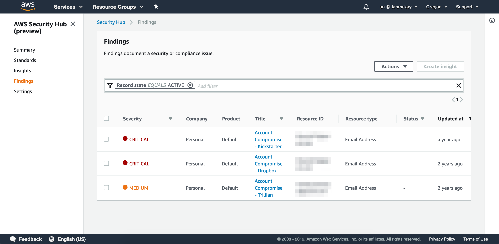

# Security Hub Custom Provider

This project shows you how you can integrate with AWS Security Hub to provide your own custom findings. In this example, we periodically check the [Troy Hunt](https://twitter.com/troyhunt)'s [Have I Been Pwned](https://haveibeenpwned.com/About) API and report findings whenever a breach is added.

## Installation

To deploy the Have I Been Pwned Custom Provider you require the following prerequisites:

* Python
* [AWS SAM CLI](https://aws.amazon.com/serverless/sam/)
* [AWS CLI](https://aws.amazon.com/cli/) (only to create a bucket for artifacts)

You should first modify the `email_addresses` variable in the src/index.py file to match the e-mail addresses you wish to monitor.

There is an included [deploy.sh](deploy.sh) script that will create a new S3 bucket for the deployment artifacts, compile the SAM template and deploy to your account. You can modify this script if you have an existing bucket for your artifacts.

## Usage

The Lambda will be executed every 24 hours (you can change this frequency in the CloudFormation template) which will call the Have I Been Pwned API for every e-mail address listed and if new breaches are discovered, it will add a finding in the AWS Security Hub console.
